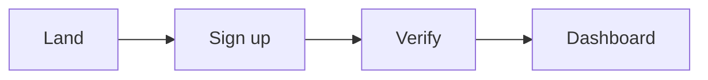

# User Journeys

## Journey: [Onboarding]

| Step | User action | System response | Touchpoint | Emotion | Risk |
|------|------------|-----------------|------------|---------|------|
| 1 | Signs up | Send verify email | Web | neutral | spam folder |
| 2 | | | | | |

## Journey: [Core workflow]

...

## Edge Cases

- Offline
- Permission denied
- Empty state
- Error recovery

## Mermaid Flow

