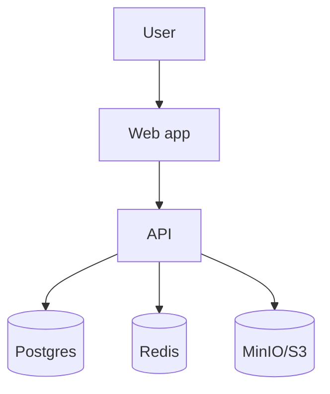

# Architecture

## Overview

> One paragraph: shape of system, key boundaries.

## Context Diagram

## Components

| Component | Responsibility | Tech | Owner |
|-----------|----------------|------|-------|
| Web | UI | Next.js | |
| API | Business logic | FastAPI | |
| DB | Persistence | Postgres | |
| Cache | Sessions, hot reads | Redis | |
| Object store | Files | MinIO/S3 | |
| Worker | Async jobs | | |

## Data Flow

1. User -> Web -> API
2. API -> DB / cache
3. Worker -> queue -> external

## Cross-Cutting

- AuthN: JWT / OAuth
- AuthZ: RBAC
- Logging: structured JSON
- Tracing: OpenTelemetry
- Config: env vars + secrets manager

## Scalability

- Horizontal scaling boundary:
- Bottlenecks:
- Caching strategy:

## Failure Modes

| Failure | Detection | Mitigation |
|---------|-----------|-----------|
| DB down | health check | read replica fallback |
