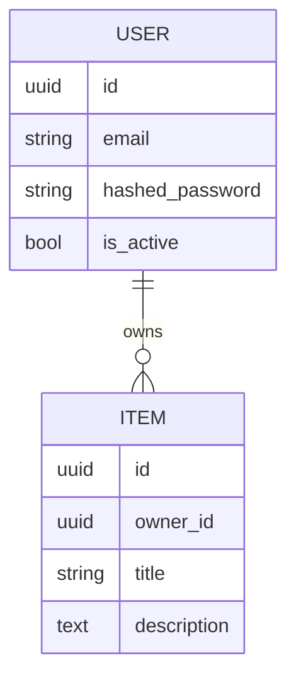

# Data Model

## ER Diagram

## Entities

### User

| Field | Type | Constraints | Notes |
|-------|------|-------------|-------|
| id | uuid | PK | |
| email | text | unique, not null | synthetic example: user@example.test |
| hashed_password | text | not null | argon2/bcrypt hash |
| is_active | bool | default true | |
| created_at | timestamptz | default now() | ISO-8601 UTC |

### Item

| Field | Type | Constraints | Notes |
|-------|------|-------------|-------|
| id | uuid | PK | |
| owner_id | uuid | FK -> user.id | |
| title | text | not null | |

## Indexes

- `user(email)` unique
- `item(owner_id)`

## Tenancy (2026-07-12, #38)

All user-facing tables are tenant-scoped; a `tenant` row (id, name, slug unique, is_active) anchors them:

| Table | tenant_id | ON DELETE | Notes |
|-------|-----------|-----------|-------|
| user | not null, indexed | RESTRICT | a tenant with users cannot be deleted |
| item | not null, indexed | CASCADE | |
| ocr_document | not null, indexed | CASCADE | |
| conversation | not null, indexed | CASCADE | `message` scoped transitively via conversation |

Global (deliberately tenant-free, per ADR-0006): `agent`, `tool`, `mcpserver`, `agenttool`, `role`, `permission`.

Bootstrap: migration `b7d4e12a9f03` and `seed_tenants` both insert a **Default** tenant (slug `default`, fixed UUID `00000000-0000-4000-8000-000000000001`, idempotent on slug) and legacy rows are backfilled to it. New signups are assigned the tenant named by `settings.DEFAULT_TENANT_SLUG`.

Enforcement: the tenant filter lives in repo queries — rows outside the caller's tenant are invisible (404, no existence leak); wrong-owner rows inside the same tenant keep 403. Superusers are platform operators and bypass the filter. DB-level RLS lands with #40.

## Migrations

- Tool: Alembic
- Naming: `YYYYMMDD_HHMM_description.py`
- Forward + backward compatible during deploys.

## Retention / Privacy

- PII fields: email
- Soft delete vs hard delete:
- GDPR export/erase:
