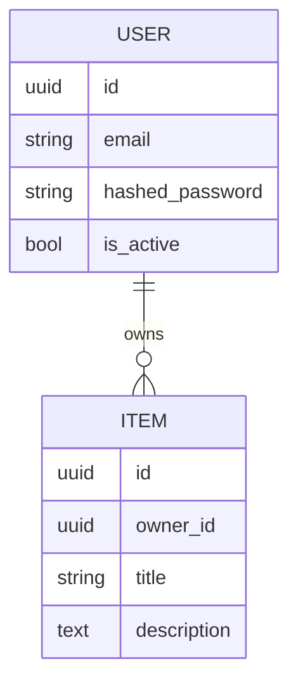

# Data Model

## ER Diagram

## Entities

### User

| Field | Type | Constraints | Notes |
|-------|------|-------------|-------|
| id | uuid | PK | |
| email | text | unique, not null | synthetic example: user@example.test |
| hashed_password | text | not null | argon2/bcrypt hash |
| is_active | bool | default true | |
| created_at | timestamptz | default now() | ISO-8601 UTC |

### Item

| Field | Type | Constraints | Notes |
|-------|------|-------------|-------|
| id | uuid | PK | |
| owner_id | uuid | FK -> user.id | |
| title | text | not null | |

## Indexes

- `user(email)` unique
- `item(owner_id)`

## Migrations

- Tool: Alembic
- Naming: `YYYYMMDD_HHMM_description.py`
- Forward + backward compatible during deploys.

## Retention / Privacy

- PII fields: email
- Soft delete vs hard delete:
- GDPR export/erase:
