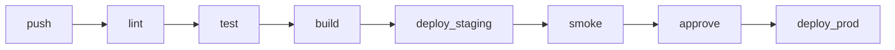

# Deployment

## Environments

| Env | URL | Branch | Auto-deploy | Data |
|-----|-----|--------|-------------|------|
| Local | localhost | any | n/a | seeded |
| CI | ephemeral | PR | yes | mocked |
| Staging | staging.example.com | master | yes | scrubbed prod |
| Prod | app.example.com | tag | manual | live |

## CI/CD Pipeline

## Build

- Backend: Docker image
- Frontend: bun build -> static + Node server
- Tag: git SHA + semver

## Release Strategy

- Blue/green or rolling.
- Feature flags for risky.
- Canary 5% -> 25% -> 100%.

## Rollback

- `kubectl rollout undo` / re-deploy prior tag.
- DB migrations: backward-compat for 1 release.

## Runbook

- Health check: `/health`
- Restart: ...
- Drain: ...
- On-call escalation: ...
